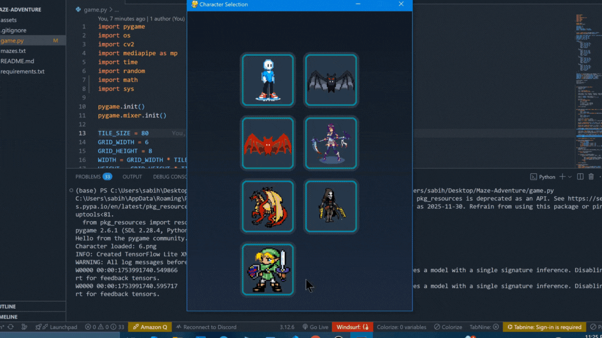

# Maze Adventure - Control with Your Hands!

This game is an interactive maze-based game built using **Python**, **Pygame**, and **MediaPipe**. Control your character either with hand gestures using your webcam or with keyboard arrow keys. Collect stars, explore themed worlds, and reach the goal to win!





---

## 🎮 Features

* **Dual Control Modes**
  🖐️ *Hand Gesture Control:* Use your index finger like a virtual joystick via your webcam
  🎮 *Keyboard Control:* Move with arrow keys

* **Themes**
  * 🌳 Forest
  * 🌌 Space
  * 🏜️ Desert
  * 🌊 Ocean

    Each theme has its own color scheme and background music.

---

## 🧠 Controls

| Action        | Keyboard                      | Camera (Hand Gesture)                     |
| ------------- | ----------------------------- | ----------------------------------------- |
| Move          | Arrow Keys                    | Move index finger away from screen center |
| Stop          | —                             | Hold finger near center of webcam frame   |
| Toggle Camera | Click Camera Icon             | —                                         |
| Show Help     | Click Help Icon / Press SPACE | —                                         |
| Exit Game     | Click Exit Icon               | —                                         |

---

## 📁 Folder Structure

```

├── main.py              
├── game/
│   ├── __init__.py
│   ├── game_state.py    
│   ├── maze.py          
│   ├── player.py        
│   ├── ui.py     
│   └── game.py           
├── controllers/
│   └── hand_controller.py
├── assets/
│   └── asset_manager.py
└── config.py  
         
```

---

## 🛠️ Installation

1. **Clone the repository:**

   ```bash
   git clone https://github.com/sabihdordab/Maze-Adventure.git
   cd Maze-Adventure
   ```

2. **Create a virtual environment (optional but recommended):**

   ```bash
   python -m venv venv
   source venv/bin/activate  # or venv\Scripts\activate 
   ```

3. **Install dependencies:**

   ```bash
   pip install -r requirements.txt
   ```

4. **Run the game:**

   ```bash
   python main.py
   ```

---

## 📷 Hand Tracking Info

Maze Adventure uses **MediaPipe**'s hand tracking module to detect hand gestures. The center zone helps avoid accidental movement. Try experimenting with webcam position and lighting for best results.

---

## 🎨 Credits

* Built using [Pygame](https://www.pygame.org/) and [MediaPipe](https://ai.google.dev/edge/mediapipe/solutions/)
* Sounds and icons from open-source resources

## 🔧 Customization

### Adding a new Maze:
```
# In mazes.txt file:

#
0, 0, 0, 0, 0, 0
0, 2, 1, 4, 1, 0
0, 1, 0, 0, 1, 0
0, 4, 1, 4, 4, 0
0, 0, 1, 0, 1, 0
0, 1, 4, 1, 3, 0
0, 0, 0, 0, 0, 0

# 0 -> wall
# 1 -> path
# 2 -> start
# 3 -> goal
# 4 -> star
```

### Changing colors:
```python

THEMES["custom"] = {
    "bg": (50, 50, 100),
    "wall": (200, 200, 200),
    "path": (100, 100, 150),
    "star": (255, 255, 100)
    ...
}
```

## 📈 Future Features

- [ ] Level editor
- [ ] Multiplayer mode
- [ ] More themes
- [ ] Mobile version
- [ ] ...